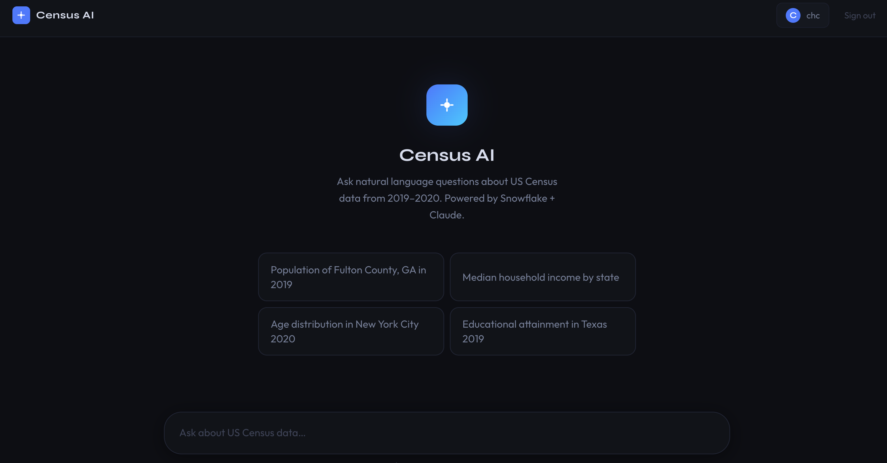

# SQL Chat Agent for Open Census Data

A full-stack conversational AI agent that answers natural-language questions about the **US Open Census dataset (2019–2020)** stored in Snowflake. Ask questions like *"What is the median household income in San Diego County?"* or *"Which counties in Texas had the highest education rates?"* and get SQL-backed answers streamed back in real time.

<div style="text-align: center;">
  
</div>

---

## Features

- **Natural Language → SQL**: ReAct agent resolves geography, looks up schema metadata, writes and executes Snowflake SQL
- **Real-time Streaming**: Server-Sent Events stream agent thinking steps, tool calls, and final answers live
- **Hierarchical RAG**: ChromaDB vector search (OpenAI embeddings) + claude-haiku reranking to identify exact ACS census columns from thousands of options
- **Guardrails**: Haiku-based content filter blocks off-topic or unsafe queries while allowing follow-up questions with conversation context
- **Persistent Chat History**: Per-user sessions stored in Firestore; sessions auto-renamed by AI after the first message
- **Markdown Rendering**: Responses rendered as formatted markdown with tables and code blocks
- **Agent Observability**: Each response shows token count, wall-clock latency, and a live step-by-step reasoning trace

---

## Architecture

```
Browser → POST /api/chat/sessions/{id}/messages
  → Guardrails check (haiku)
  → Save user message to Firestore
  → SSE stream:
      ReAct loop (sonnet-4-6)
        └─ search_fips_codes      → Snowflake FIPS metadata
        └─ search_feature_schema  → ChromaDB + haiku reranking
        └─ get_field_descriptions → Snowflake schema metadata
        └─ execute_sql            → Snowflake SELECT
        └─ fetch_knowledge        → On-demand recovery guides
      + concurrent task: session auto-rename (haiku)
```

### Three-Tier Context Management

To avoid bloating the system prompt and causing instruction dilution, knowledge is loaded in tiers:

| Tier | What | When loaded |
|------|------|-------------|
| System prompt | Universal reasoning rules | Always |
| Tool descriptions | Per-tool usage guidance | Every iteration (zero cost) |
| Knowledge files (`docs/tool_knowledge/`) | Edge-case recovery guides | Only on tool failure |

---

## Tech Stack

| Layer | Technology |
|-------|-----------|
| **Agent** | Anthropic Claude (sonnet-4-6 + haiku-4-5), native SDK — no LangChain |
| **Backend** | Python, FastAPI, `uv`, Pydantic |
| **Vector Store** | ChromaDB (local), OpenAI `text-embedding-3-large` |
| **Database** | Snowflake (US Open Census Data) |
| **Auth / Storage** | JWT, GCP Firestore |
| **Frontend** | React 19, TypeScript, Vite, Tailwind CSS |
| **Deployment** | GCP Cloud Run (backend), Firebase Hosting (frontend) |
| **CI/CD** | GitHub Actions |

---

## Local Setup

### Prerequisites

- Python 3.11+, [`uv`](https://docs.astral.sh/uv/)
- Node.js 18+, `pnpm`
- Snowflake account with the [US Open Census Data](https://app.snowflake.com/marketplace/listing/GZSTZ491VXY) marketplace dataset
- Anthropic API key, OpenAI API key
- GCP project with Firestore enabled (`gcloud auth application-default login`)

### Backend

```bash
cd backend
cp .env.example .env   # fill in your credentials
uv sync
uv run python -c "from app.main import app; print('OK')"  # sanity check
uv run uvicorn app.main:app --reload --port 8080
```

Populate the ChromaDB vector store (required once before feature search works):

```bash
make embed_feature_docs
```

### Frontend

```bash
cd frontend
pnpm install
pnpm dev   # http://localhost:5173
```

---

## Environment Variables

| Variable | Description |
|----------|-------------|
| `SNOWFLAKE_ACCOUNT` | Snowflake account identifier |
| `SNOWFLAKE_USER` | Snowflake username |
| `SNOWFLAKE_PASSWORD` | Snowflake password |
| `SNOWFLAKE_WAREHOUSE` | Compute warehouse |
| `SNOWFLAKE_DATABASE` | Database name |
| `SNOWFLAKE_SCHEMA` | Schema name |
| `ANTHROPIC_API_KEY` | For the ReAct agent and guardrails |
| `OPENAI_API_KEY` | For ChromaDB embeddings |
| `JWT_SECRET` | JWT signing secret |
| `USERS` | JSON array: `[{"username":"...","password":"..."}]` |
| `GCP_PROJECT_ID` | Firestore project ID |

---

## Future Improvements

- [ ] Human-in-the-loop clarification (e.g., "New York" → city or state?)
- [ ] Augmented knowledge base for more edge-case query types
- [ ] Enable chat message editing and response termination
